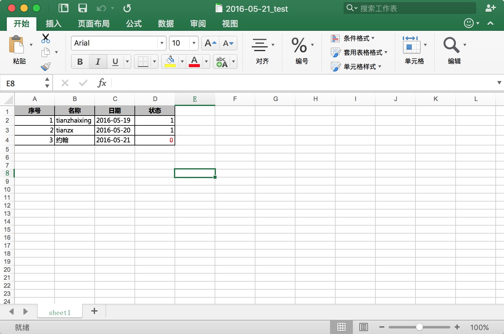

# Python-Excel
Using Python language to operate excel file with the help of three-party modules.

## Requirements

- Python
- xlwt

## Run 

Just run this simple script by typing `python write2excel.py` in your own terminal. like:

```
$ python write2excel.py
```


## Result



## Thanks

[xlwt](https://github.com/python-excel/xlwt)
